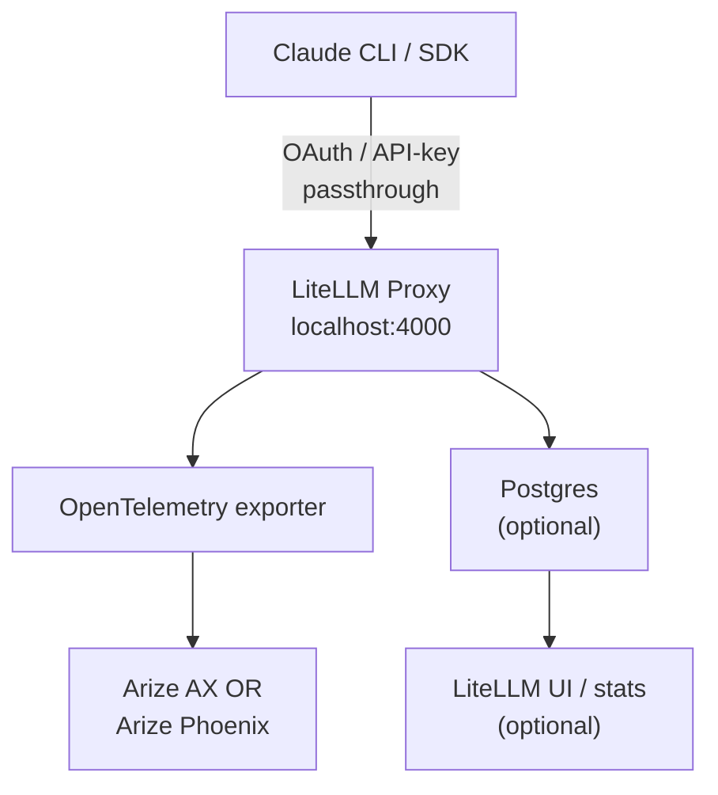

# Dev-Agent-Lens with LiteLLM and Arize Integration

A proxy setup for Open Source, Open Telemetry Compliant, or proxyable Developer Agents to add observability, monitoring, and tracing capabilities. Each layer can be easily hosted or depolyed anywhere, allowing teams to view all of their traces in a single pane of glass, no matter the deployment needs.

The first developer agent is Claude Code, Dev-Agent-Lens comes complete with seamless OAuth Passthrough for Pro and Max plans.

Leverage observability to track cost, identify common errors, and increase your teams shipping velocity.

## Overview

This repository provides a transparent proxy layer for Claude Code that:

- Intercepts Claude Code API calls and routes them through LiteLLM
- Adds AI observability and monitoring via Arize AI
- Maintains full compatibility with the standard Claude Code CLI
- Provides centralized model configuration and management

## Architecture



## Prerequisites

- Docker and Docker Compose
- Claude Code CLI installed (`curl -fsSL https://claude.ai/install.sh | sh`)
- Anthropic API key (get from <https://console.anthropic.com/settings/keys>)

## Quick Start

Get started in under 2 minutes by choosing your observability backend!

### 1. Setup Environment

```bash
# Copy the example environment file
cp .env.example .env

# Edit .env and add ONLY your Anthropic API key (OAuth will pass through automatically)
# ANTHROPIC_API_KEY=sk-ant-api03-your-key-here

# For Arize AX, also add:
# ARIZE_API_KEY=your-arize-api-key
# ARIZE_SPACE_KEY=your-arize-space-key
```

### 2. Choose Your Observability Backend

**Option A: Arize AX (Cloud)**

```bash
# Start with Arize AX cloud observability
docker compose --profile arize up -d
```

**Option B: Phoenix (Local)**

```bash
# Start with local Phoenix observability
docker compose --profile phoenix up -d

# Access Phoenix UI at http://localhost:6006
```

### 3. Use Claude Code

```bash
# Use the wrapper script with default settings (localhost:4000)
./claude-lens

# Or install globally for convenience
sudo cp claude-lens /usr/local/bin
claude-lens

# Use different proxy configurations:
./claude-lens --proxy-url http://localhost:4001  # For advanced profile
CLAUDE_LENS_PROXY_URL=http://remote-server:4000 ./claude-lens  # Via environment
./claude-lens --help  # View all configuration options
```

**That's it!** Claude Code now routes through LiteLLM for consistent API handling.

## Session Tracking (Phoenix)

Track different workflows, prompt versions, and costs using Phoenix session metadata.

### Quick Start with Sessions

```bash
# Start a code review session with prompt v2
./claude-session --type code-review --version v2 --name "async-refactor"

# Run Claude Code commands in the session
claude code "Review this authentication module"

# Reset when done
./claude-session --reset
```

### Use Cases

- **Track cost per workflow**: Compare spending across code-review, debugging, documentation
- **Iterate on prompts**: Test v1, v2, v3 and measure token usage, latency, quality
- **A/B testing**: Compare different prompt approaches side-by-side
- **Filter in Phoenix**: Use session.type, session.prompt_version, session.name

### Session Commands

```bash
# Interactive session shell
./claude-session --type debugging --version v1 --shell

# One-off command with session
./claude-session --type testing --version v2 "Generate unit tests for auth.py"

# Reset to defaults
./claude-session --reset

# Help and options
./claude-session --help
```

**📖 [Complete Session Tracking Guide →](SESSION_TRACKING.md)**

## View Observability in Arize

- Open [Arize AI Dashboard](https://app.arize.com)
- Navigate to your project
- Filter traces: `status_code = 'OK' and attributes.llm.token_count.total > 0`

## Claude Code SDK Examples

This repository includes comprehensive examples for integrating the Claude Code SDK with Dev-Agent-Lens observability in both **TypeScript** and **Python**. These examples demonstrate advanced usage patterns, specialized agents, and full observability integration.

Note: Due to Claude Code SDK authentication options, OAuth passthrough for the SDK is not supported.

### Available Examples

**TypeScript Examples** (`examples/typescript/`):

- **Basic Usage**: Simple SDK setup with proxy observability
- **Code Review Agent**: Automated code analysis with structured feedback
- **Custom Tools**: Advanced tool integration and execution tracing
- **Documentation Generator**: Automatic API documentation generation

**Python Examples** (`examples/python/`):

- **Basic Usage**: Core SDK functionality with streaming responses
- **Observable Agent**: Advanced agent framework with:
  - Security Analysis Agent (vulnerability detection)
  - Incident Response Agent (automated incident handling)
  - Session management and history tracking

### Quick Start with Examples

Our examples contain code samples to leverage the Claude Code SDKs for python and typescript, while maintaining the proxy and observability features from Dev-Agent-Lens.

```bash
# 1. Ensure the proxy is running (choose your observability backend)
docker compose --profile arize up -d    # Arize AX (cloud)
# OR: docker compose --profile phoenix up -d  # Phoenix (local)

# 2. Try TypeScript examples
cd examples/typescript
npm install
npm run basic                    # Basic usage
npm run review basic-usage.ts    # Code review

# 3. Try Python examples
cd examples/python
uv pip install -e .
uv run python basic_usage.py     # Basic usage
uv run python observable_agent.py # Advanced agents
```

All examples automatically route through the LiteLLM proxy for full observability without requiring command-line exports.

📖 **[View Complete Examples Guide →](examples/README.md)**

## Configuration

### Model Routing

The proxy uses wildcard routing in `litellm_config.yaml` to allow Claude Code to select any model:

- **Automatic Pass-through**: Any model Claude Code selects is automatically routed to Anthropic
- **Wildcard Support**: Supports patterns like `claude-*`, `anthropic/*`, and `claude-opus-*`
- **No Model Override**: The proxy doesn't force a specific model - Claude Code decides
- **Optional Aliases**: `sonnet` and `haiku` shortcuts are available but not required

### Services

- **LiteLLM Proxy**: Port 4000
- **Health Check**: <http://localhost:4000/health>
- **OpenTelemetry**: Configured for Arize endpoint (when ARIZE keys are configured)

## Key Files

- `claude-lens` - Wrapper script that starts Claude Code with proxy configuration
- `docker-compose.yml` - Service definition and environment setup
- `litellm_config.yaml` - Model routing and callback configuration
- `.env.example` - Example environment variables file
- `.env` - Your local environment configuration (not tracked in git)

## Docker Compose Configuration

The `docker-compose.yml` file sets up the LiteLLM proxy:

### LiteLLM Proxy Service

- **Image**: Custom OAuth-enabled image (`aowen14/litellm-oauth-fix:latest`)
- **Port mapping**: 4000 (host) → 4000 (container)
- **Configuration**: Mounts `litellm_config.yaml` for model routing
- **Environment**: Passes through API keys and Arize configuration
- **Health checks**: Automatic health monitoring every 30 seconds
- **Restart policy**: Automatically restarts unless manually stopped

## Development

To modify the proxy configuration:

1. Edit `litellm_config.yaml` to change model mappings or callbacks
2. Update `.env` with your API credentials
3. Restart the proxy: `docker-compose restart`

## Managing the Proxy

### Starting the proxy

```bash
docker-compose up -d
```

### Stopping the proxy

```bash
docker-compose down
```

### Viewing logs

```bash
docker-compose logs -f
```

### Restarting after configuration changes

```bash
docker-compose restart
```

## Troubleshooting

- **Check if services are running**: `docker-compose ps`
- **Verify proxy health**: `curl http://localhost:4000/health`
- **View real-time logs**: `docker-compose logs -f litellm-proxy`
- **Verify environment variables**: Ensure required variables are set in `.env`
- **Claude Lens errors**: The wrapper script will check if the proxy is running before starting Claude Code
- **OAuth issues**: Check logs for OAuth token detection and passthrough messages
- **API key fallback**: Ensure `ANTHROPIC_API_KEY` is set if not using OAuth

## Benefits

- **Complete Observability**: Full visibility into Claude Code usage
- **Zero Configuration**: Works transparently with existing Claude Code workflows
- **Enterprise Ready**: Built-in monitoring and cost tracking
- **Model Management**: Centralized configuration for all Claude models
- **Extensible**: Based on LiteLLM's robust proxy framework
